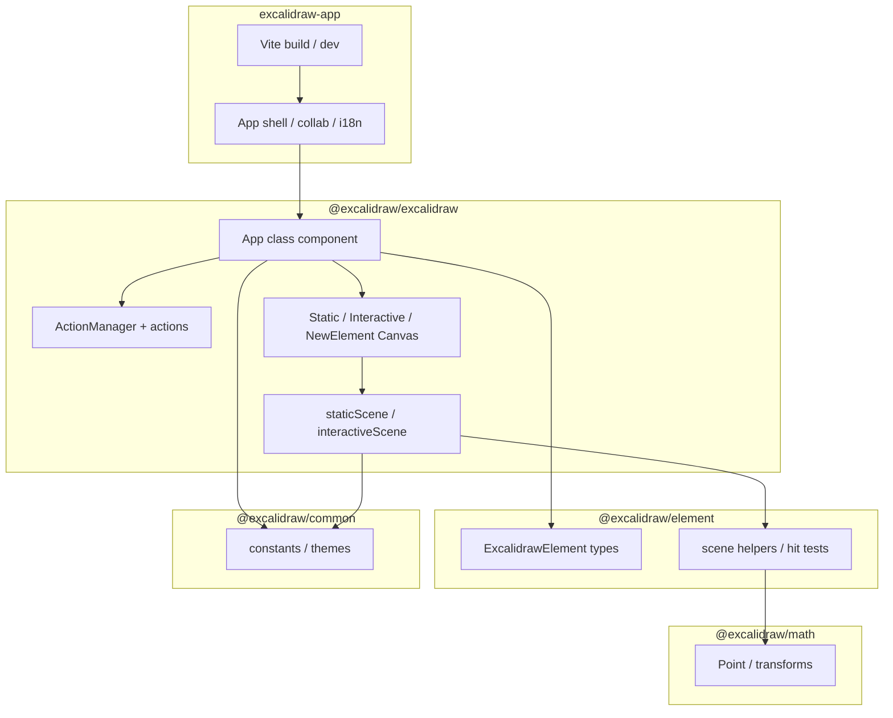
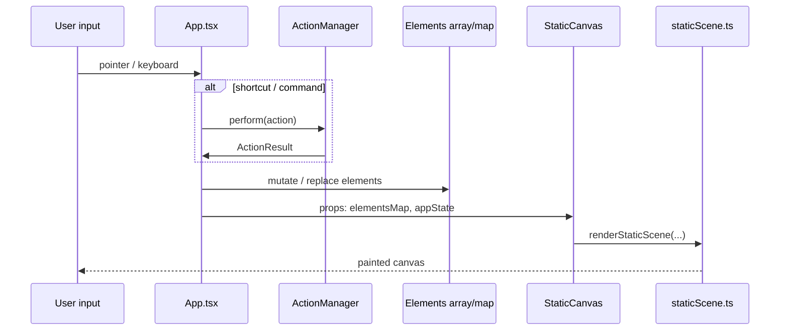
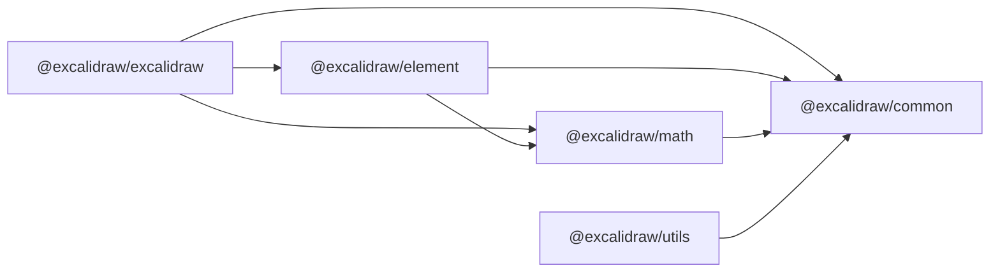

# Архітектура Excalidraw monorepo

Технічний опис архітектури форку Excalidraw: межі пакетів, потік даних, стан, рендеринг і залежності. Узгоджено з вихідним кодом у `excalidraw-app/` та `packages/*`.

---

## 1. High-level Architecture

Monorepo розділяє **додаток** (продуктовий shell, колаборація, збірка Vite) і **бібліотеку редактора** (`@excalidraw/excalidraw`), яку можна вбудовувати в інші продукти. Спільна модель даних — **елементи** (`@excalidraw/element`) і **геометрія** (`@excalidraw/math`).



**Ролі:**

- **`excalidraw-app`** — збірка, hosting-логіка, зовнішні сервіси (наприклад Firebase, Sentry, socket.io-client з `excalidraw-app/package.json`).
- **`packages/excalidraw`** — React UI, canvas-рендер, експорт, діалоги, історія змін; публічний API пакета.
- **`packages/element`** — канонічні типи елементів і операції над ними (групи, фрейми, прив’язки).
- **`packages/math`** — математика для координат і геометрії.
- **`packages/common`** — спільні константи та типи, щоб уникати циклічних залежностей між `element` і `excalidraw`.

---

## 2. Data Flow

### 2.1. Від користувача до елементів

1. Події вказівки/клавіатури обробляються в **`App`** (`components/App.tsx`): `handleCanvasPointerDown`, `handleCanvasPointerMove`, `onKeyDown` тощо.
2. Залежно від `appState.activeTool` і проміжних полів (`newElement`, `multiElement`, `selectionElement`) створюється або оновлюється елемент, або змінюється виділення.
3. Оновлений список елементів і новий фрагмент `AppState` передаються вниз у canvas-компоненти та функції рендеру.



### 2.2. Експорт і серіалізація

- Експорт PNG/SVG та JSON проходить через модулі **`packages/excalidraw/scene/export.ts`** та пов’язаний код: на вхід подаються поточні елементи, `AppState` (фон, zoom, тема), прапорці експорту.
- Для вбудовування хост передає початкові елементи через props пакета і отримує колбеки змін (деталі в `packages/excalidraw/README.md`).

### 2.3. Колаборація (високий рівень)

- Редактор тримає в `AppState` інформацію про **колабораторів** і їхні виділення/курсори.
- Синхронізація «джерела правди» елементів відбувається на рівні додатку через мережевий шар; редактор застосовує злиття версій елементів (`version`, `versionNonce`, `index` у типах елемента — `packages/element/src/types.ts`).

---

## 3. State Management

### 3.1. AppState

- **`AppState`** (`packages/excalidraw/types.ts`) описує майже весь UI-стан: інструмент, scroll, zoom, виділення, відкриті діалоги (`openDialog`), режими zen/view, сітка, колаборація, crop тощо.
- Початкові значення з **`getDefaultAppState()`** у `packages/excalidraw/appState.ts` (без полів розмірів вікна, які виставляються пізніше).

### 3.2. Елементи сцени

- Елементи — це **іммутабельно-орієнтовані** структури: зміни створюють нові об’єкти з інкрементом `version` / новим `versionNonce` для узгодження.
- **Групи та фрейми** виражені через `groupIds` та `frameId` на елементі.
- **Прив’язки стрілок** — `boundElements` на елементі та логіка binding у редакторі (`appState.startBoundElement`, `suggestedBinding`).

### 3.3. ActionManager

- **`ActionManager`** агрегує об’єкти **`Action`** за полем `name` і викликає `perform`, передаючи контекст додатку.
- Це розділяє **UI-команди** (копіювання, вирівнювання, перемикання інструменту) від низькорівневої обробки подій canvas.

### 3.4. Jotai та інше

- У залежностях пакета є **jotai** / **jotai-scope** — для локального UI-стану окремих піддерев; доменна сцена залишається в `App` + елементи.

---

## 4. Rendering Pipeline

### 4.1. Два canvas-шари

1. **Static canvas** — малює фон, сітку (за налаштуванням), видимі елементи через **roughjs** (`RoughCanvas`).
2. **Interactive canvas** — поверх статичного: рамка виділення, точки редагування ліній, scrollbars, індикатори колаборації.

Компоненти: `packages/excalidraw/components/canvases/StaticCanvas.tsx`, `InteractiveCanvas.tsx`, `NewElementCanvas.tsx`.

### 4.2. Функції рендеру

- **`_renderStaticScene`** у `packages/excalidraw/renderer/staticScene.ts`:
  - нормалізує розміри canvas з урахуванням `devicePixelRatio`;
  - застосовує `zoom` через `context.scale`;
  - малює сітку (`strokeGrid`);
  - ітерує **видимі** елементи й віддає їх у lower-level render.
- **`_renderInteractiveScene`** у `packages/excalidraw/renderer/interactiveScene.ts`:
  - ті ж transform zoom;
  - малює selection element, linear handles, remote pointers з `InteractiveCanvasRenderConfig` (`scene/types.ts`).

### 4.3. Новий елемент під час жесту

- Поки користувач тягне або клацає для створення фігури, стан **`appState.newElement`** оновлюється; окремий **`NewElementCanvas`** викликає **`renderNewElementScene`** (`renderer/renderNewElementScene.ts`), щоб не змішувати проміжний малюнок з повною статичною сценою.

### 4.4. Анімація інтерактивного шару

- `InteractiveCanvas` може запускати **`AnimationController`** для коротких анімацій (наприклад підсвітка binding), передаючи `deltaTime` у `renderInteractiveScene`.

### 4.5. Від React до пікселів (скорочено)

```
App.render()
  → StaticCanvas + InteractiveCanvas (+ NewElementCanvas)
    → useLayoutEffect / callbacks
      → renderStaticScene / renderInteractiveScene / renderNewElementScene
        → Canvas 2D API + roughjs
```

---

## 5. Package Dependencies

### 5.1. Напрямки залежностей



- **`excalidraw-app`** залежить від зібраного пакета редактора та React-екосистеми додатку.
- **`examples/*`** можуть залежати від `@excalidraw/excalidraw` для демонстрації інтеграції.

### 5.2. Публічні entrypoints пакета редактора

- У `packages/excalidraw/package.json` поле **`exports`** визначає entry для `.`, `./index.css`, а також підшляхи `./common/*`, `./element/*`, `./math/*`, `./utils/*` для типів і допоміжних імпортів у споживачів.

### 5.3. Збірка пакетів

- Скрипт **`build:packages`** у корені послідовно збирає `common`, `math`, `element`, `excalidraw` (`package.json` scripts).
- Окремий пакет збирається через `scripts/buildPackage.js` (викликається з `packages/excalidraw` як `build:esm`).

---

## 6. Тестування та інструменти

- **Vitest** для unit/integration тестів у monorepo (`yarn test:app`).
- **TypeScript** проєктні посилання між пакетами забезпечують узгодженість типів на етапі `yarn test:typecheck`.

---

## 7. Пов’язані документи

- Короткий огляд патернів: [systemPatterns.md](../memory/systemPatterns.md).
- Онбординг і PR: [dev-setup.md](./dev-setup.md).
- Словник термінів: [domain-glossary.md](../product/domain-glossary.md).
- PRD: [PRD.md](../product/PRD.md).
- Memory Bank: [projectbrief.md](../memory/projectbrief.md), [techContext.md](../memory/techContext.md).
