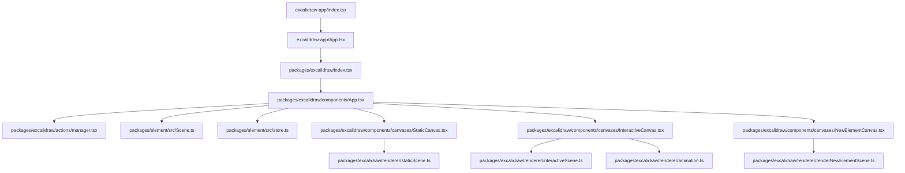

# Architecture Overview

## 1. High-level Architecture

### Repository and runtime boundaries

- Monorepo root defines Yarn workspaces for `excalidraw-app`, `packages/*`, and `examples/*` (`package.json`).
- Main application bootstrap is in `excalidraw-app/index.tsx` (`createRoot`, `registerSW`, render `ExcalidrawApp`).
- Main application shell is in `excalidraw-app/App.tsx` (wrapper around `<Excalidraw />`, collaboration and loading flows).
- Core editor library entry is `packages/excalidraw/index.tsx` (exports and mounts `App` inside providers).
- Core editor implementation is in `packages/excalidraw/components/App.tsx` (state owner, action execution, input handling, render composition).
- Element model and scene container are in `packages/element/src/Scene.ts` and `packages/element/src/store.ts`.

### Layered structure confirmed from code

- **UI layer**
  - React UI components and menus in `packages/excalidraw/components/*`.
  - App wrapper UI and integrations in `excalidraw-app/App.tsx`.
  - Example host UIs in `examples/with-script-in-browser/index.tsx` and `examples/with-nextjs/src/*`.
- **State layer**
  - `AppState` type in `packages/excalidraw/types.ts`.
  - default app state factory in `packages/excalidraw/appState.ts`.
  - element collections and scene caches in `packages/element/src/Scene.ts`.
  - change-capture store in `packages/element/src/store.ts`.
- **Logic/controllers**
  - action registration and dispatch in `packages/excalidraw/actions/manager.tsx`.
  - action definitions in `packages/excalidraw/actions/*`.
  - pointer/keyboard/wheel interaction logic in `packages/excalidraw/components/App.tsx`.
- **Rendering layer**
  - renderable selection/culling in `packages/excalidraw/scene/Renderer.ts`.
  - static canvas rendering in `packages/excalidraw/renderer/staticScene.ts`.
  - interactive overlay rendering in `packages/excalidraw/renderer/interactiveScene.ts`.
  - new-element preview rendering in `packages/excalidraw/renderer/renderNewElementScene.ts`.
  - animation frame loop in `packages/excalidraw/renderer/animation.ts`.
- **Services/integration**
  - initial scene loading and collab startup in `excalidraw-app/App.tsx`.
  - Firebase-backed app integration modules in `excalidraw-app/data/*` and `excalidraw-app/collab/*`.
  - service worker registration call in `excalidraw-app/index.tsx`.

### High-level interaction (confirmed modules only)

- `excalidraw-app/index.tsx` mounts `ExcalidrawApp`.
- `excalidraw-app/App.tsx` renders `<Excalidraw />` and uses imperative API (`updateScene`, `addFiles`) for async updates.
- `packages/excalidraw/index.tsx` provides context, initializes editor environment, and renders `packages/excalidraw/components/App.tsx`.
- `packages/excalidraw/components/App.tsx` owns state, scene, action manager, event handlers, and render composition.
- Canvas components call renderer modules, while scene/store updates trigger re-render cycles.



## 2. Data Flow

### Synchronous flow: pointer interaction to rendering

- Step 1: pointer event is attached on interactive canvas (`onPointerDown`, `onPointerMove`, `onPointerUp`) (`packages/excalidraw/components/canvases/InteractiveCanvas.tsx`).
- Step 2: event handlers in `App` process input (`handleCanvasPointerDown`, `onPointerMoveFromPointerDownHandler`, pointer-up handlers) (`packages/excalidraw/components/App.tsx`).
- Step 3: handlers mutate app state and/or scene through `setState`, `syncActionResult`, `updateScene`, `scene.mutateElement`, `scene.replaceAllElements` (`packages/excalidraw/components/App.tsx`, `packages/element/src/Scene.ts`).
- Step 4: scene update callback (`scene.onUpdate(this.triggerRender)`) is registered in lifecycle (`packages/excalidraw/components/App.tsx`).
- Step 5: render phase computes visible/renderable subsets using renderer helper (`getRenderableElements`) (`packages/excalidraw/components/App.tsx`, `packages/excalidraw/scene/Renderer.ts`).
- Step 6: canvas layers call renderer functions (`renderStaticScene`, `renderInteractiveScene`, `renderNewElementScene`) (`packages/excalidraw/components/canvases/*`, `packages/excalidraw/renderer/*`).

### Synchronous flow: keyboard shortcut to rendering

- `addEventListeners` and `onKeyDown` are managed by `App` (`packages/excalidraw/components/App.tsx`).
- `onKeyDown` routes shortcuts to `actionManager.handleKeyDown(...)` where matching action is selected (`packages/excalidraw/components/App.tsx`, `packages/excalidraw/actions/manager.tsx`).
- Action execution returns `ActionResult` (`packages/excalidraw/actions/types.ts`).
- `ActionManager` forwards action result to updater (`this.syncActionResult`) (`packages/excalidraw/actions/manager.tsx`).
- `syncActionResult` applies `elements`/`appState` changes and scene replacement (`packages/excalidraw/components/App.tsx`).
- Updated state triggers React/canvas rendering path (same renderer modules listed above).

### Synchronous flow: wheel/gesture to rendering

- Wheel event handler is bound on interactive canvas (`packages/excalidraw/components/App.tsx`, JSX bindings).
- `handleWheel(...)` computes scroll/zoom behavior and calls canvas translation helpers (`packages/excalidraw/components/App.tsx`).
- Two-pointer gesture logic updates zoom/translation in pointer move path (`packages/excalidraw/components/App.tsx`).
- App state changes (`scrollX`, `scrollY`, `zoom`) affect render params for static/interative/new-element canvases (`packages/excalidraw/types.ts`, `packages/excalidraw/components/canvases/*`).

### Async flow: initial scene and collaboration load

- Wrapper defines `initializeScene` async function (`excalidraw-app/App.tsx`).
- Flow includes resolving room/link/local data and optional collaboration start (`startCollaboration`) (`excalidraw-app/App.tsx`).
- Result is applied via imperative API (`excalidrawAPI.updateScene(...)`) (`excalidraw-app/App.tsx`).
- Image loading path `loadImages(...)` is async and later calls API methods (`updateScene`, `addFiles`) (`excalidraw-app/App.tsx`).
- These API calls feed into core app update pipeline inside `packages/excalidraw/components/App.tsx`.

### Async flow: actions can be promise-based

- `ActionManager` accepts either direct `ActionResult` or promise-like result (`isPromiseLike`) (`packages/excalidraw/actions/manager.tsx`).
- Promise path resolves and then invokes updater (`packages/excalidraw/actions/manager.tsx`).
- Updater is connected to `syncActionResult` in core app (`packages/excalidraw/components/App.tsx`).

### Orchestration comments / architecture notes in code

- `FIXME normalize/set defaults in parent component` comment in Excalidraw entry wrapper (`packages/excalidraw/index.tsx`).
- `TODO` comments indicating state placement for interactive canvas fields (`packages/excalidraw/types.ts`).
- `TODO this is a hack` and other interaction-flow TODOs in central app controller (`packages/excalidraw/components/App.tsx`).

## 3. State Management

### appState

- **Definition**
  - `AppState` type is declared in `packages/excalidraw/types.ts`.
  - default state object is produced by `getDefaultAppState()` in `packages/excalidraw/appState.ts`.
- **Structure**
  - Confirmed keys include editor tool state, selection, viewport, dialogs, export flags, collaboration map, snapping and cropping fields (`packages/excalidraw/appState.ts`).
  - Storage behavior per key is configured in `APP_STATE_STORAGE_CONF` (`packages/excalidraw/appState.ts`).
- **How it changes**
  - Action pathway: `Action.perform(...)` -> updater -> `syncActionResult` -> `setState(...)` (`packages/excalidraw/actions/types.ts`, `packages/excalidraw/actions/manager.tsx`, `packages/excalidraw/components/App.tsx`).
  - Imperative pathway: `updateScene({ appState })` applies state through `setState` (`packages/excalidraw/components/App.tsx`).
  - Direct pathway: multiple event handlers directly call `this.setState` (`packages/excalidraw/components/App.tsx`).
- **Who modifies it**
  - Core app controller (`packages/excalidraw/components/App.tsx`).
  - Actions via `ActionManager` updater hook (`packages/excalidraw/actions/manager.tsx`).
  - External wrapper via API (`excalidraw-app/App.tsx` calling `excalidrawAPI.updateScene(...)`).
- **Who reads it**
  - React render path and canvases (`packages/excalidraw/components/App.tsx`, `packages/excalidraw/components/canvases/*`).
  - UI hooks/context consumers (`packages/excalidraw/context/ui-appState.ts`, components under `packages/excalidraw/components/*`).

### elements

- **Definition**
  - Scene-owned element arrays/maps are private fields in `Scene`:
    - `elements`
    - `elementsMap`
    - `nonDeletedElements`
    - `nonDeletedElementsMap`
    (`packages/element/src/Scene.ts`).
- **Data structure**
  - Scene stores both including-deleted and non-deleted subsets (`packages/element/src/Scene.ts`).
  - Selection cache keyed by selection options exists in `Scene` (`packages/element/src/Scene.ts`).
- **Lifecycle**
  - Replaced in bulk with `replaceAllElements(...)` (`packages/element/src/Scene.ts`).
  - Mutated incrementally with `mutateElement(...)` and map utilities (`packages/element/src/Scene.ts`).
  - Scene updates notify listeners through `triggerUpdate()` and `onUpdate(...)` (`packages/element/src/Scene.ts`).
- **Relationship to rendering**
  - `App.render()` asks renderer for renderable elements from scene elements (`packages/excalidraw/components/App.tsx`, `packages/excalidraw/scene/Renderer.ts`).
  - Canvas renderers consume these subsets (`packages/excalidraw/components/canvases/*`, `packages/excalidraw/renderer/*`).

### actionManager

- **Definition**
  - `ActionManager` class in `packages/excalidraw/actions/manager.tsx`.
- **Role**
  - Registers actions (`registerAction`, `registerAll`) and executes them from keyboard/UI/API contexts (`packages/excalidraw/actions/manager.tsx`).
- **Dispatch behavior**
  - `handleKeyDown(...)` resolves one matching action and dispatches it (`packages/excalidraw/actions/manager.tsx`).
  - `executeAction(...)` executes direct action invocation (`packages/excalidraw/actions/manager.tsx`).
  - Both paths call `this.updater(action.perform(...))` (`packages/excalidraw/actions/manager.tsx`).
- **Interaction with state**
  - `ActionManager` does not own state storage.
  - It reads current state/elements via injected getters and forwards results to updater (`packages/excalidraw/actions/manager.tsx`).
  - In core app, updater is bound to `syncActionResult` (`packages/excalidraw/components/App.tsx`).

### Other stores, reducers, contexts

- **Store objects found**
  - Element/app-state delta store: `Store`, `StoreDelta`, `StoreSnapshot` in `packages/element/src/store.ts`.
  - Editor Jotai store and provider: `editorJotaiStore`, `EditorJotaiProvider` (`packages/excalidraw/editor-jotai.ts`, `packages/excalidraw/index.tsx`).
  - App-level Jotai store in wrapper app: `appJotaiStore` (`excalidraw-app/app-jotai.ts`).
- **Reducers**
  - Redux-style reducer setup: **Not found in code**.
  - `useReducer`-based central app reducer: **Not found in code**.
- **Contexts**
  - Excalidraw API contexts provided in `packages/excalidraw/index.tsx`.
  - UI app state context module present in `packages/excalidraw/context/ui-appState.ts`.
  - Additional context modules under `packages/excalidraw/context/*`.

## 4. Rendering Pipeline

### React component path to canvases

- `excalidraw-app/index.tsx` mounts `ExcalidrawApp`.
- `excalidraw-app/App.tsx` renders `<Excalidraw .../>`.
- `packages/excalidraw/index.tsx` renders `<App .../>` inside providers.
- `packages/excalidraw/components/App.tsx` composes rendering layers:
  - UI components (menus, dialogs, panels).
  - `SVGLayer`.
  - `StaticCanvas`.
  - `NewElementCanvas`.
  - `InteractiveCanvas`.

### Rendering stages

- Stage A: gather renderable data in `App.render()` via `renderer.getRenderableElements(...)` (`packages/excalidraw/components/App.tsx`, `packages/excalidraw/scene/Renderer.ts`).
- Stage B: static layer draws scene content with `renderStaticScene(...)` (`packages/excalidraw/components/canvases/StaticCanvas.tsx`, `packages/excalidraw/renderer/staticScene.ts`).
- Stage C: draft/new-element layer draws with `renderNewElementScene(...)` (`packages/excalidraw/components/canvases/NewElementCanvas.tsx`, `packages/excalidraw/renderer/renderNewElementScene.ts`).
- Stage D: interactive layer draws overlays and collaborators using animation controller + `renderInteractiveScene(...)` (`packages/excalidraw/components/canvases/InteractiveCanvas.tsx`, `packages/excalidraw/renderer/animation.ts`, `packages/excalidraw/renderer/interactiveScene.ts`).

### Render triggers and re-render conditions

- React state updates (`setState`) in app controller trigger render (`packages/excalidraw/components/App.tsx`).
- Scene changes call `scene.triggerUpdate()`, and listener `scene.onUpdate(this.triggerRender)` bridges to render cycle (`packages/element/src/Scene.ts`, `packages/excalidraw/components/App.tsx`).
- Action execution results pass through `syncActionResult` and can replace elements/state (`packages/excalidraw/components/App.tsx`, `packages/excalidraw/actions/manager.tsx`).
- Imperative API `updateScene` from wrapper triggers same internal update paths (`excalidraw-app/App.tsx`, `packages/excalidraw/components/App.tsx`).

### Performance-related behavior confirmed in code

- Throttling used in rendering modules:
  - `renderStaticSceneThrottled` in `packages/excalidraw/renderer/staticScene.ts`.
  - `renderNewElementSceneThrottled` in `packages/excalidraw/renderer/renderNewElementScene.ts`.
- Frame loop uses `requestAnimationFrame` through `AnimationController` (`packages/excalidraw/renderer/animation.ts`).
- Scene caches selected elements and non-deleted maps (`packages/element/src/Scene.ts`).
- Scene map/update helpers avoid unnecessary array renewal in specific methods (`packages/element/src/Scene.ts` comments and implementations).

## 5. Package Dependencies

### Workspace/package inventory

- Root workspaces: `excalidraw-app`, `packages/*`, `examples/*` (`package.json`).
- Internal packages under `packages/`:
  - `@excalidraw/common` (`packages/common/package.json`)
  - `@excalidraw/math` (`packages/math/package.json`)
  - `@excalidraw/element` (`packages/element/package.json`)
  - `@excalidraw/excalidraw` (`packages/excalidraw/package.json`)
  - `@excalidraw/utils` (`packages/utils/package.json`)

### Confirmed dependency directions

- `@excalidraw/math` -> `@excalidraw/common` (`packages/math/package.json`).
- `@excalidraw/element` -> `@excalidraw/common`, `@excalidraw/math` (`packages/element/package.json`).
- `@excalidraw/excalidraw` -> `@excalidraw/common`, `@excalidraw/element`, `@excalidraw/math` (`packages/excalidraw/package.json`).
- `@excalidraw/utils` -> `@excalidraw/element` (confirmed import `getCommonBounds` from `@excalidraw/element`) (`packages/utils/src/index.ts`).
- `excalidraw-app` consumes core editor package by rendering `<Excalidraw />` (`excalidraw-app/App.tsx`).

### Dependencies not confirmed as internal links

- `@excalidraw/utils` direct dependency declaration on `@excalidraw/element` in its package manifest: **Not found in code** (`packages/utils/package.json`).
- Internal runtime coupling beyond imports/manifests shown above: **Not found in code**.

```mermaid
graph LR
  C[@excalidraw/common]
  M[@excalidraw/math]
  E[@excalidraw/element]
  X[@excalidraw/excalidraw]
  U[@excalidraw/utils]
  A[excalidraw-app]
  S[examples/with-script-in-browser]
  N[examples/with-nextjs]

  C --> M
  C --> E
  M --> E
  C --> X
  M --> X
  E --> X
  E --> U
  X --> A
  X --> S
  X --> N
```

### Entry points (package/app/examples)

- App runtime entry: `excalidraw-app/index.tsx`.
- Library entry: `packages/excalidraw/index.tsx`.
- Package source entries:
  - `packages/common/src/index.ts`
  - `packages/math/src/index.ts`
  - `packages/element/src/index.ts`
  - `packages/utils/src/index.ts`
- Example entries:
  - `examples/with-script-in-browser/index.tsx`
  - `examples/with-nextjs/src/app/page.tsx`
  - `examples/with-nextjs/src/pages/excalidraw-in-pages.tsx`

## Verified Missing/Unavailable Items

- Server runtime entry such as `server.ts`: **Not found in code**.
- Central backend API layer inside `packages/excalidraw` for network transport: **Not found in code**.
- Single global reducer-based store replacing `App` + `Scene` + `Store` model: **Not found in code**.
