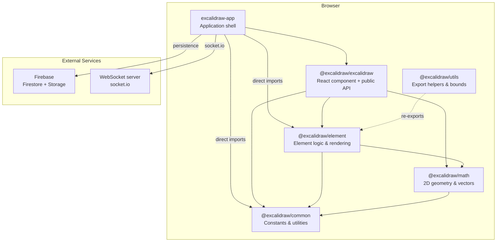
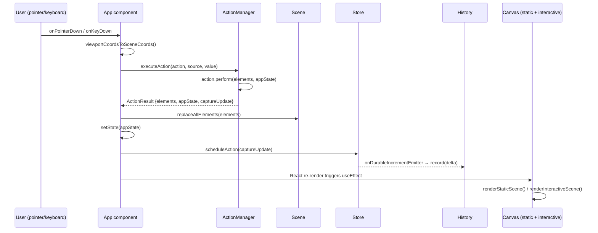
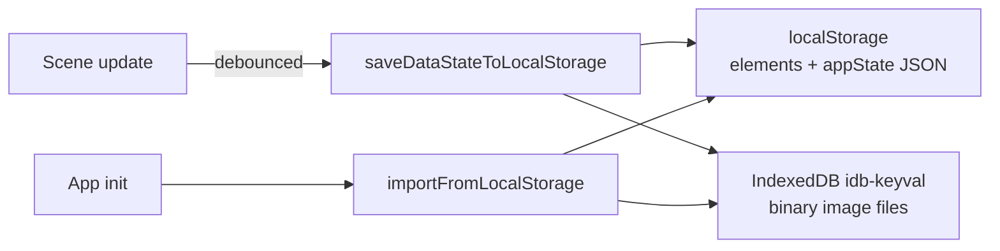
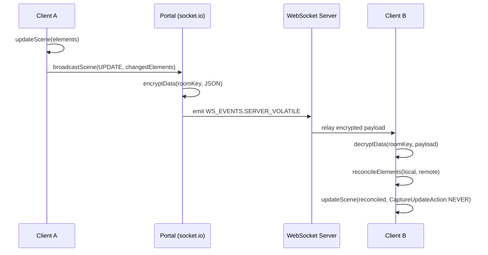
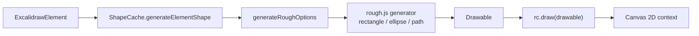
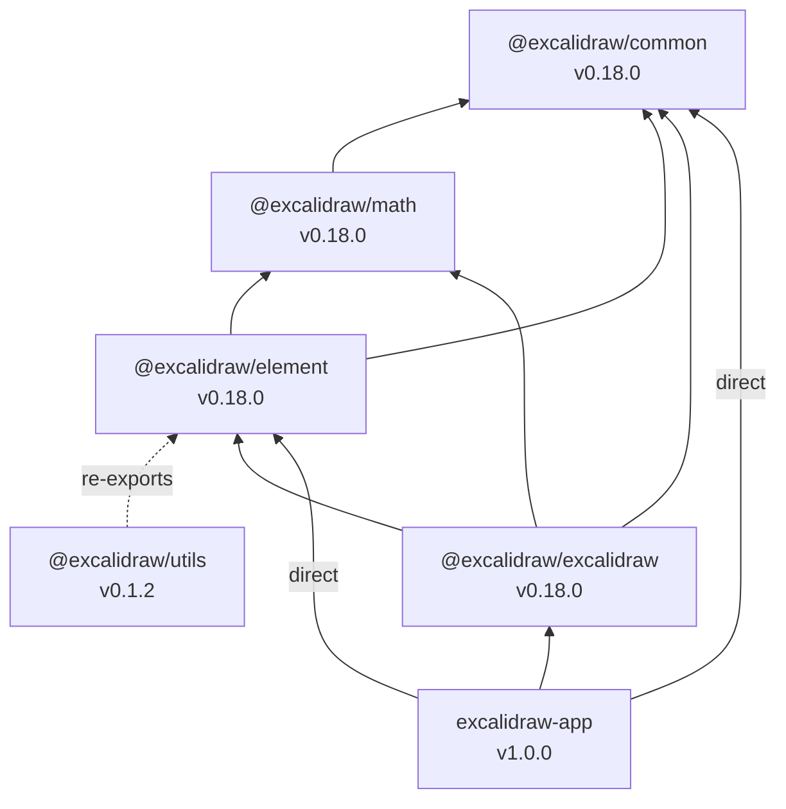

# Excalidraw Architecture

## High-level Architecture

Excalidraw is a monorepo (`yarn workspaces`) containing a browser-based drawing
editor (`excalidraw-app`) and a set of npm packages (`packages/*`) that can be
embedded into third-party React applications.



### Component Responsibilities

| Layer | Path | Role |
|-------|------|------|
| Application shell | `excalidraw-app/` | Collaboration, persistence, auth, Firebase/socket.io integration |
| React component | `packages/excalidraw/` | Core editor UI, actions, rendering pipeline, public API |
| Element logic | `packages/element/` | Element CRUD, shape generation, collision, bounds, Scene class |
| Math | `packages/math/` | Points, vectors, curves, polygons, segments, angles |
| Common | `packages/common/` | Constants (`FONT_FAMILY`, `THEME`, `MIME_TYPES`), shared helpers, event emitter |
| Utils | `packages/utils/` | `exportToCanvas/Blob/Svg`, bounding-box queries |

---

## Data Flow

### User Input → State → Canvas



### Pointer Handling

The main `App` class component (`packages/excalidraw/components/App.tsx`) captures
all pointer events on the canvas and converts viewport coordinates to scene
coordinates. Tool-specific handlers are then dispatched:

- `handleTextOnPointerDown()` — text creation/editing
- `handleLinearElementOnPointerDown()` — arrows and lines
- `handleFreeDrawElementOnPointerDown()` — freehand drawing
- `createFrameElementOnPointerDown()` — frame creation

An `onPointerDownEmitter` broadcasts events to any subscribers.

### Persistence (Local)



- **localStorage** stores serialised elements (`STORAGE_KEYS.LOCAL_STORAGE_ELEMENTS`)
  and cleaned app state (`STORAGE_KEYS.LOCAL_STORAGE_APP_STATE`).
- **IndexedDB** (`files-db/files-store`) stores binary image data with
  `lastRetrieved` timestamps. `clearObsoleteFiles()` removes images not
  referenced for 24 h.
- **Tab sync** (`excalidraw-app/data/tabSync.ts`) broadcasts changes via
  `StorageEvent` and compares scene versions to prevent loops.

### Collaboration



Key details tracked in `excalidraw-app/collab/Portal.tsx`:

- `broadcastedElementVersions` tracks each element's last-broadcast version to
  minimise payload.
- All scene data is AES-GCM encrypted with the room key before transmission.
- `reconcileElements()` (`packages/excalidraw/data/reconcile.ts`) resolves
  conflicts: local wins if element is being edited; otherwise higher `version`
  wins; `versionNonce` breaks ties deterministically.
- Reconciled remote updates use `CaptureUpdateAction.NEVER` to skip undo/redo.

### Firebase Storage

Scene data in Firestore is stored as encrypted blobs:

```typescript
// excalidraw-app/data/firebase.ts
type FirebaseStoredScene = {
  sceneVersion: number;
  iv: Bytes;          // AES-GCM initialisation vector
  ciphertext: Bytes;  // encrypted JSON
};
```

Image files are stored in Firebase Storage under
`files/rooms/{roomId}/` and encrypted with the same room key.

### Serialisation Formats

`serializeAsJSON()` (`packages/excalidraw/data/json.ts`) outputs:

```json
{
  "type": "excalidraw",
  "version": 2,
  "source": "https://excalidraw.com",
  "elements": [],
  "appState": {},
  "files": {}
}
```

- **"local"** variant includes binary files and full app state.
- **"database"** variant strips files and sensitive state
  (`clearAppStateForDatabase()`).

Export targets: JSON file, PNG (with metadata embedded via png-chunk-text),
SVG (`renderSceneToSvg()`), clipboard (plain text / PNG / SVG).

---

## State Management

### Overview

State is split into three categories managed by different mechanisms:

| Category | Storage | Updated via |
|----------|---------|-------------|
| UI / viewport state | `AppState` (React class component `this.state`) | `setState()` through `syncActionResult` |
| Elements | `Scene` instance (`packages/element/src/Scene.ts`) | `scene.replaceAllElements()` |
| Derived / UI atoms | Jotai atoms (`editor-jotai.ts`, `app-jotai.ts`) | `useAtom()` / `useSetAtom()` |

### AppState

`AppState` is defined in `packages/excalidraw/types.ts` with ~100 properties.
`getDefaultAppState()` in `packages/excalidraw/appState.ts` provides defaults.

Key property groups:

- **Viewport**: `scrollX`, `scrollY`, `zoom`, `width`, `height`, `offsetLeft`,
  `offsetTop`
- **Active tool**: `activeTool`, `penMode`, `penDetected`
- **Selection**: `selectedElementIds`, `selectedGroupIds`,
  `selectedLinearElement`, `hoveredElementIds`
- **Editing**: `editingTextElement`, `editingGroupId`, `editingFrame`,
  `croppingElementId`
- **In-progress creation**: `newElement`, `resizingElement`, `multiElement`,
  `selectionElement`, `selectedElementsAreBeingDragged`, `isRotating`
- **Styling defaults**: `currentItemStrokeColor`, `currentItemBackgroundColor`,
  `currentItemFontSize`, `currentItemOpacity`, …
- **Collaboration**: `collaborators` (Map), `userToFollow`, `followedBy`
- **Theme / export**: `theme`, `exportWithDarkMode`, `exportScale`,
  `viewBackgroundColor`

### Elements & Scene

`Scene` (`packages/element/src/Scene.ts`) maintains four parallel representations:

| Field | Type | Content |
|-------|------|---------|
| `elements` | `readonly OrderedExcalidrawElement[]` | Complete array including deleted |
| `elementsMap` | `SceneElementsMap` | Map by ID including deleted |
| `nonDeletedElements` | `readonly NonDeletedExcalidrawElement[]` | Filtered for `isDeleted === false` |
| `nonDeletedElementsMap` | `NonDeletedSceneElementsMap` | Map by ID, non-deleted only |

Elements are immutable value objects. Mutations produce new element references
via `newElementWith()`. Deleted elements are retained (with `isDeleted: true`)
for collaboration tombstoning; each mutation increments `version` and
regenerates `versionNonce`.

### ActionManager

`ActionManager` (`packages/excalidraw/actions/manager.tsx`) is the central
command bus:

```
ActionManager
├── actions: Record<ActionName, Action>     // ~60 registered actions
├── registerAction(action)                  // single registration
├── registerAll(actions[])                  // bulk via actions/register.ts
├── handleKeyDown(event)                    // keyboard shortcut dispatch
├── executeAction(action, source, value?)   // run action by source
└── renderAction(name, data?)               // render action's UI panel
```

Each `Action.perform()` receives `(elements, appState, formData, app)` and
returns `ActionResult`:

```typescript
type ActionResult = {
  elements?: readonly ExcalidrawElement[] | null;
  appState?: Partial<AppState> | null;
  files?: BinaryFiles | null;
  captureUpdate: CaptureUpdateActionType;
} | false;
```

`syncActionResult()` in `App` applies the result: calls
`scene.replaceAllElements()` for element changes and `this.setState()` for
appState changes, then schedules `Store` capture.

### Store & History (Undo/Redo)

`Store` (`packages/element/src/store.ts`) captures incremental deltas:

```typescript
class Store {
  onDurableIncrementEmitter: Emitter<[DurableIncrement]>;
  onStoreIncrementEmitter: Emitter<[DurableIncrement | EphemeralIncrement]>;
  private _snapshot: StoreSnapshot;   // last committed state
}
```

`CaptureUpdateAction` controls what is recorded:

| Value | Behaviour | Used for |
|-------|-----------|----------|
| `IMMEDIATELY` | Delta pushed to undo stack at once | Local user edits |
| `EVENTUALLY` | Captured with the next `IMMEDIATELY` | Multi-step async operations |
| `NEVER` | Skipped entirely | Remote collaboration updates, scene init |

`History` (`packages/excalidraw/history.ts`) stores two stacks of
`HistoryDelta` entries. `App.componentDidMount()` subscribes to
`store.onDurableIncrementEmitter` and calls `history.record(delta)`.
`Ctrl+Z` / `Ctrl+Shift+Z` execute the undo/redo actions which call
`history.undo()` / `history.redo()`.

### Jotai Atoms

Both `excalidraw-app` and `packages/excalidraw` use Jotai for localised
reactive state that does not belong in `AppState`:

| Scope | Store | Key atoms |
|-------|-------|-----------|
| Editor | `editorJotaiStore` | `isSidebarDockedAtom`, `isLibraryMenuOpenAtom`, `activeEyeDropperAtom`, `activeConfirmDialogAtom`, `searchQueryAtom`, `libraryItemsAtom` |
| App | `appJotaiStore` | `collabAPIAtom`, `isCollaboratingAtom`, `isOfflineAtom`, `activeRoomLinkAtom`, `shareDialogStateAtom`, `appLangCodeAtom`, `localStorageQuotaExceededAtom` |

### React Context Distribution

`App.render()` wraps children with context providers:

- `ExcalidrawAppStateContext` → `this.state` (AppState)
- `ExcalidrawSetAppStateContext` → `this.setAppState`
- `ExcalidrawElementsContext` → `scene.getNonDeletedElements()`
- `ExcalidrawActionManagerContext` → `this.actionManager`
- `ExcalidrawAPIContext` → imperative API for external consumers

---

## Rendering Pipeline

### Dual-Canvas Architecture

Excalidraw uses two logical rendering layers backed by separate canvas elements:

| Layer | Component | Rendering function | Content |
|-------|-----------|-------------------|---------|
| Static | `StaticCanvas` (`packages/excalidraw/components/canvases/StaticCanvas.tsx`) | `renderStaticScene()` | Shapes, grid, background |
| Interactive | `InteractiveCanvas` (`packages/excalidraw/components/canvases/InteractiveCanvas.tsx`) | `renderInteractiveScene()` | Selection handles, transform controls, remote cursors |

The main `App` class creates the canvas and `RoughCanvas` wrapper:

```typescript
// packages/excalidraw/components/App.tsx
this.canvas = document.createElement("canvas");
this.rc = rough.canvas(this.canvas);
```

### Static Scene (shapes)

`renderStaticScene()` (`packages/excalidraw/renderer/staticScene.ts`):

1. Clears canvas and applies viewport transform (zoom + scroll).
2. Draws grid if enabled.
3. Iterates `visibleElements` and for each calls
   `renderElement()` → `drawElementOnCanvas()`
   (`packages/element/src/renderElement.ts`).
4. Throttled via `throttleRAF` to cap redraws.

Trigger: `StaticCanvas` `useEffect()` fires when props (elements, appState)
change; calls `renderStaticScene()`.

### Interactive Scene (UI overlays)

`renderInteractiveScene()` (`packages/excalidraw/renderer/interactiveScene.ts`):

1. Draws selection outlines and transform handles.
2. Renders linear-element editing points.
3. Draws snap guide lines (`renderSnaps.ts`).
4. Renders remote collaborator cursors and usernames.
5. Draws new-element preview during creation.

Trigger: `InteractiveCanvas` starts a continuous loop via `AnimationController`
(`packages/excalidraw/renderer/animation.ts`) using `requestAnimationFrame()`.
The loop runs only while animations are active (binding highlights, cursor
fading); otherwise it stops to save resources.

### Shape Generation (rough.js)



`ShapeCache` (`packages/element/src/shape.ts`) caches `Drawable` objects per
element to avoid regeneration. `generateRoughOptions()` translates element
properties (`seed`, `roughness`, `strokeWidth`, `fillStyle`) into rough.js
config. Shape type dispatch:

| Element type | rough.js call |
|-------------|---------------|
| Rectangle / Diamond | `generator.rectangle()` or `generator.path()` (rounded corners) |
| Ellipse | `generator.ellipse()` |
| Arrow / Line | Array of segment shapes + arrowhead paths |
| Freedraw | Mix of `generator.path()` and `Path2D` |
| Text | Direct canvas `fillText` (no rough.js) |
| Image | Direct `context.drawImage()` (no rough.js) |

### SVG Export Path

SVG export uses a separate code path: `renderSceneToSvg()`
(`packages/excalidraw/renderer/staticSvgScene.ts`) walks elements and produces
SVG DOM nodes instead of Canvas 2D calls.

### Renderer Directory

| File | Purpose |
|------|---------|
| `renderer/staticScene.ts` | Main static-layer rendering |
| `renderer/interactiveScene.ts` | Interactive-layer rendering |
| `renderer/animation.ts` | `AnimationController` — `requestAnimationFrame` scheduler |
| `renderer/renderNewElementScene.ts` | Preview for element being drawn |
| `renderer/staticSvgScene.ts` | SVG export renderer |
| `renderer/renderSnaps.ts` | Snap guide lines |
| `renderer/helpers.ts` | `bootstrapCanvas()`, `fillCircle()`, dimension normalisation |
| `renderer/roundRect.ts` | Rounded-rectangle path utility |

---

## Package Dependencies

### Dependency Graph



### Per-Package Summary

#### @excalidraw/common (base layer, zero internal deps)

Foundation of the stack. Provides constants (`FONT_FAMILY`, `THEME`,
`MIME_TYPES`), colour helpers (via `tinycolor2`), binary heap, URL and key
utilities, event emitter, and `appEventBus`.

#### @excalidraw/math → common

2D geometry library: `Point`, `Vector`, angles, line segments, curves (Bézier),
ellipses, polygons, rectangles, triangles, ranges, and utility functions.

#### @excalidraw/element → common, math

Element domain model: type definitions (`ExcalidrawElement` union), `Scene`
class, `Store` / `CaptureUpdateAction`, element lifecycle (`newElement`,
`mutateElement`, `duplicateElement`), shape generation via rough.js
(`ShapeCache`), collision detection, bounds, binding, z-index, grouping,
frames, linear-element editor, text measurement, and `renderElement()`.

#### @excalidraw/utils → (re-exports from element)

Thin public-facing helpers: `exportToCanvas()`, `exportToBlob()`,
`exportToSvg()`, and bounding-box queries (`elementsOverlappingBBox`,
`isElementInsideBBox`). Does not declare `@excalidraw/element` as a dependency
but re-exports from it — works because the monorepo build bundles them together.

#### @excalidraw/excalidraw → common, math, element

Integration hub and public API surface. Exports the `<Excalidraw />` React
component, UI sub-components (`Sidebar`, `MainMenu`, `WelcomeScreen`,
`CommandPalette`, `TTDDialog`), data operations (`serializeAsJSON`,
`loadFromBlob`, `restoreElements`, `reconcileElements`), i18n, fonts, and
re-exports key types/functions from all lower-level packages.

Key external dependencies: `jotai` (state atoms), `roughjs` (shape
rendering), `radix-ui` (accessible primitives), `perfect-freehand` (pen
strokes), `pako` (compression), `codemirror` (code editing in TTD),
`sass` (styles).

Peer dependencies: `react ^17 || ^18 || ^19`, `react-dom ^17 || ^18 || ^19`.

#### excalidraw-app → excalidraw, element (direct), common (direct)

Application shell. Adds Firebase persistence, socket.io-based real-time
collaboration (encryption via Web Crypto API), Sentry error monitoring,
language detection, PWA support, share dialog, and AI/TTD features.

Runtime dependencies: `firebase`, `socket.io-client`, `jotai`, `sentry`,
`idb-keyval`, `i18next-browser-languagedetector`.

### Build Order

Packages must be built bottom-up due to the dependency chain:

```
common → math → element → excalidraw
```

The root script `yarn build:packages` enforces this order.
