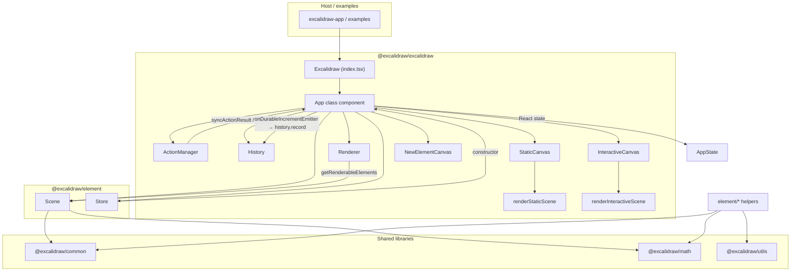
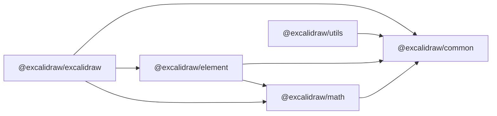

# Excalidraw monorepo — technical architecture

This document describes how the repository is structured and how the editor moves data from React state through the scene model to canvas drawing. Every statement is grounded in the TypeScript sources under this workspace unless noted as coming from a `package.json` manifest.

For **undocumented behavior, doc/implementation gaps, and refactor hazards** (empty `setState`, `componentDidUpdate` ordering, `TODO`/`FIXME`/`HACK` hotspots), see [`decisionLog.md`](../memory/decisionLog.md).

---

## High-level architecture

The repository is a Yarn workspaces monorepo (`name`: `excalidraw-monorepo` in the root `package.json`). Workspaces include `excalidraw-app`, `packages/*`, and `examples/*`.

The interactive editor is implemented primarily inside `@excalidraw/excalidraw`: a class component `App` (`packages/excalidraw/components/App.tsx`) owns React `AppState`, a `Scene` instance for elements, a `Store` for undo-related increments, `History`, an `ActionManager` for command-style updates, and a `Renderer` that memoizes which elements are visible for drawing.

Published-style libraries live under `packages/common`, `packages/math`, `packages/element`, and `packages/utils`. The shell application under `excalidraw-app` imports the editor and supporting modules (for example `excalidraw-app/App.tsx` imports from `@excalidraw/excalidraw` and deeper entry points such as `@excalidraw/excalidraw/data/restore`).

### Diagram (components and data owners)

The `Store` class is defined in `packages/element/src/store.ts` and takes the `App` instance in its constructor (`constructor(private readonly app: App)`), which ties the element package’s change-tracking to the concrete editor class.

---

## Data flow: how data moves through the system

### 1. User or API initiates a change

Typical entry points include:

- **`ActionManager`**: keyboard shortcuts call `handleKeyDown`, which runs `action.perform(...)` and passes the result to the `updater` callback installed at construction time. Programmatic use goes through `executeAction`. UI panels use `renderAction`, which calls `perform` when `updateData` runs (`packages/excalidraw/actions/manager.tsx`).
- **`App.updateScene`**: public API-style updates accept optional `elements`, `appState`, `collaborators`, and `captureUpdate` (`packages/excalidraw/components/App.tsx`).
- **Direct `setState`**: some paths update React state only (for example ephemeral UI), and may call `scene.triggerUpdate()` indirectly via other APIs.

The `ActionManager` constructor receives:

- `updater` → bound to `this.syncActionResult` on `App`,
- `getAppState` → `() => this.state`,
- `getElementsIncludingDeleted` → `() => this.scene.getElementsIncludingDeleted()`,
- `app` → the `App` instance (`packages/excalidraw/components/App.tsx`, constructor).

### 2. `syncActionResult` applies an `ActionResult`

`syncActionResult` (wrapped with `withBatchedUpdates`) interprets `ActionResult` objects (`packages/excalidraw/actions/types.ts`): optional `elements`, `appState`, `files`, `replaceFiles`, and required `captureUpdate` (typed as `CaptureUpdateActionType` from `@excalidraw/element` / `store.ts`).

In order of effect (`packages/excalidraw/components/App.tsx`):

1. `this.store.scheduleAction(actionResult.captureUpdate)` records how the update should be treated for the `Store` (immediate durable increment vs ephemeral, per `CaptureUpdateAction` in `packages/element/src/store.ts`).
2. If `actionResult.elements` is set, `this.scene.replaceAllElements(actionResult.elements)` replaces the scene’s element list.
3. If `actionResult.files` is set, `addMissingFiles` and `addNewImagesToImageCache` run.
4. If `actionResult.appState` (or related branches) applies, `this.setState` merges into React state (with special handling for `editingTextElement`, controlled props like `viewModeEnabled`, etc.).
5. If nothing changed the scene or state, `this.scene.triggerUpdate()` still notifies subscribers.

### 3. `updateScene` coordinates Store scheduling and Scene replacement

`updateScene` (`packages/excalidraw/components/App.tsx`):

- When `captureUpdate` is passed, it calls `this.store.scheduleMicroAction({ action: captureUpdate, elements, appState: observedAppState })` so the `Store` can compute a snapshot delta before commit.
- Applies `appState` via `setState`, `elements` via `scene.replaceAllElements`, and `collaborators` via `setState`.

The JSDoc on `updateScene` documents the three capture modes: `IMMEDIATELY`, `NEVER`, and `EVENTUALLY`, aligned with `CaptureUpdateAction` in `packages/element/src/store.ts`.

### 4. Scene mutation notifies listeners

`Scene.replaceAllElements` (`packages/element/src/Scene.ts`) rebuilds internal arrays and maps (`elements`, `elementsMap`, non-deleted caches, frame lists), then calls `triggerUpdate()`, which sets `sceneNonce` to a new random integer and invokes all registered callbacks.

In `App.componentDidMount`, the editor registers `this.scene.onUpdate(this.triggerRender)` (`packages/excalidraw/components/App.tsx`), so each scene-triggered update schedules a React re-render path that eventually recomputes visible elements and redraws canvases.

### 5. React render reads Scene and Renderer

In `App.render`, the code calls `this.renderer.getRenderableElements({...})` with zoom, scroll, dimensions, `editingTextElement`, `newElementId`, and `sceneNonce` (`packages/excalidraw/components/App.tsx`). That returns `elementsMap` and `visibleElements` used as props to `StaticCanvas`, optional `NewElementCanvas`, and `InteractiveCanvas`.

### 6. After React commits: Store commit and host notification

At the **start** of `App.componentDidUpdate` (`packages/excalidraw/components/App.tsx`), a one-way **`_initialized` flag** may flip on the first update where `!isLoading`, emitting `editor:initialize` and calling `onInitialize` **before** `this.appStateObserver.flush(prevState)`—which notifies subscribers registered via `api.onStateChange` (`AppStateObserver.flush` in `packages/excalidraw/components/AppStateObserver.ts`). See [`decisionLog.md`](../memory/decisionLog.md) §B for why that order matters.

`App.componentDidUpdate` **ends** with `this.store.commit(elementsMap, this.state)` where `elementsMap` is `this.scene.getElementsMapIncludingDeleted()`. When not loading, it also invokes `this.props.onChange` and `this.onChangeEmitter` with the current elements and state.

`Store.commit` flushes micro-actions, processes the scheduled macro action, and may emit durable or ephemeral increments (`packages/element/src/store.ts`).

In `App.componentDidMount`, `this.store.onDurableIncrementEmitter.on((increment) => { this.history.record(increment.delta); })` forwards each durable increment to `History.record` (`packages/excalidraw/components/App.tsx`). The `History` instance is created as `new History(this.store)` in the `App` constructor. Optional `onIncrement` listeners attach to `onStoreIncrementEmitter` in the same lifecycle method when the prop is provided.

### 7. Canvas drawing (side effect layer)

`StaticCanvas` and `InteractiveCanvas` use `useEffect` to run drawing routines when React runs effects after render; they are not “React rendering” in the DOM sense for the bitmap itself—they attach or reuse `HTMLCanvasElement` nodes and call into `renderStaticScene` / `renderInteractiveScene` (`packages/excalidraw/components/canvases/StaticCanvas.tsx`, `InteractiveCanvas.tsx`).

---

## State management: `AppState`, elements, and `ActionManager`

### `AppState` (React component state)

- **Type**: `AppState` is declared in `packages/excalidraw/types.ts` (large interface covering tool, selection, viewport, theme, dialogs, collaboration-related fields, export settings, etc.).
- **Defaults**: `getDefaultAppState()` in `packages/excalidraw/appState.ts` returns the initial shape (excluding `offsetTop`, `offsetLeft`, `width`, `height`, which come from the canvas layout).
- **Instance**: `App` uses `class App extends React.Component<AppProps, AppState>` and initializes `this.state` in the constructor from defaults plus props such as `viewModeEnabled`, `zenModeEnabled`, `gridModeEnabled`, `theme`, and `name` (`packages/excalidraw/components/App.tsx`).
- **UI-facing subset**: `UIAppState` is `AppState` omitting `startBoundElement`, `cursorButton`, `scrollX`, and `scrollY` (`packages/excalidraw/types.ts`). `UIAppStateContext` exposes this to descendant UI (`packages/excalidraw/context/ui-appState.ts`).
- **Subscriptions**: `useAppStateValue` / `useOnAppStateChange` in `packages/excalidraw/hooks/useAppStateValue.ts` read via `useExcalidrawAPI()` and `api.onStateChange`, allowing fine-grained re-renders outside the full `App` tree when an `ExcalidrawAPIProvider` is present (documented in that file).

### Elements (Scene-owned, not React state)

- **Storage**: Elements live in `Scene`: private `elements`, `elementsMap`, derived `nonDeletedElements`, `nonDeletedElementsMap`, and related frame caches (`packages/element/src/Scene.ts`).
- **Access from `App`**: Methods such as `getSceneElements`, `getSceneElementsIncludingDeleted`, and maps like `getNonDeletedElementsMap` delegate to `this.scene` (`packages/excalidraw/components/App.tsx`).
- **Updates**: Bulk replacement goes through `replaceAllElements`. Individual mutations exist (for example `mutateElement` usage from scene APIs). Fractional index validation is throttled in `Scene` via `validateIndicesThrottled` (`packages/element/src/Scene.ts`).
- **Ordering / integrity**: `replaceAllElements` runs `syncInvalidIndices` on the incoming array before assigning (`packages/element/src/Scene.ts`).

### `Store` (undo increments and snapshots)

- **Role**: Captures differences between snapshots of the element map and `AppState`, emitting `DurableIncrement` or `EphemeralIncrement` events (`packages/element/src/store.ts`).
- **`CaptureUpdateAction`**: `IMMEDIATELY`, `NEVER`, and `EVENTUALLY` control whether updates are undoable immediately, excluded from history, or deferred—described in comments on the `CaptureUpdateAction` object and on `App.updateScene`.
- **Commit path**: `App.componentDidUpdate` always calls `commit` with the latest scene map and React state so scheduled actions flush after renders.

### `History`

- **Construction**: `new History(this.store)` in `App` (`packages/excalidraw/components/App.tsx`).
- **Integration**: Undo/redo actions are registered on the `ActionManager`: `createUndoAction(this.history)` and `createRedoAction(this.history)` right after `registerAll(actions)`.

### `ActionManager`

- **Registry**: `this.actions` is a `Record<ActionName, Action>`. `registerAll` loads the standard action set; undo/redo are added separately (`packages/excalidraw/components/App.tsx` constructor).
- **Execution flow**: `perform` receives `(elements, appState, value, app)` and returns `ActionResult | Promise<ActionResult>`. The manager’s `updater` normalizes promises (`isPromiseLike`) before calling the app’s `syncActionResult` (`packages/excalidraw/actions/manager.tsx`).
- **Predicate / UI**: `isActionEnabled` and `renderAction` respect `UIOptions.canvasActions` toggles when present (`packages/excalidraw/actions/manager.tsx`).

### Additional state outside `AppState` / Scene

- **Binary files**: `App` maintains an image/file map used when serializing or rendering; `syncActionResult` merges files via `addMissingFiles`.
- **Rough canvas**: `this.canvas`, `this.rc = rough.canvas(this.canvas)`, and `this.interactiveCanvas` back the static and interactive layers (`packages/excalidraw/components/App.tsx` constructor).
- **Jotai**: `EditorJotaiProvider` and `editorJotaiStore` wrap the public `Excalidraw` component tree (`packages/excalidraw/index.tsx`) for editor-scoped atoms (used alongside React state).

---

## Rendering pipeline: from React component to canvas

### 1. `App.render` computes drawable subsets

- **Selection**: `selectedElements` from `this.scene.getSelectedElements(this.state)` (`packages/excalidraw/components/App.tsx`).
- **Renderable map and visibility**: `this.renderer.getRenderableElements({ sceneNonce, zoom, offsetLeft, offsetTop, scrollX, scrollY, height, width, editingTextElement, newElementId })` (`packages/excalidraw/scene/Renderer.ts`).
  - Inner logic builds a `RenderableElementsMap` that skips the element matching `newElementId` and skips the text element currently being edited (so text editing can be handled separately).
  - Visibility uses `isElementInViewport` from `@excalidraw/element` with viewport parameters from `AppState`.
  - Results are memoized; `sceneNonce` from `Scene.getSceneNonce()` is explicitly part of the cache key to invalidate when the scene signals an update (`packages/excalidraw/scene/Renderer.ts` comments describe `sceneNonce` as a renderer cache-invalidation nonce).

### 2. React tree: canvas wrapper components

- **`StaticCanvas`** (`packages/excalidraw/components/canvases/StaticCanvas.tsx`):

  - Receives `canvas` (shared `HTMLCanvasElement` from `App`), `rc` (RoughJS canvas), `elementsMap`, `allElementsMap`, `visibleElements`, `sceneNonce`, `selectionNonce`, `scale` (`window.devicePixelRatio`), `appState`, and `renderConfig` (image cache, grid, theme, embed validation, etc.).
  - On mount, `wrapper.replaceChildren(canvas)` places the canvas in a div; `useEffect` syncs CSS size and buffer dimensions from `appState.width` / `height` and `scale`.
  - Calls `renderStaticScene({...}, isRenderThrottlingEnabled())`. When throttling is enabled, `renderStaticScene` delegates to `renderStaticSceneThrottled` (RAF-throttled); otherwise it calls `_renderStaticScene` directly (`packages/excalidraw/renderer/staticScene.ts`).
  - `React.memo` equality compares `sceneNonce`, `scale`, `elementsMap`, `visibleElements`, shallow equality of a subset of `AppState` via `getRelevantAppStateProps`, and `renderConfig`.

- **`NewElementCanvas`**: Rendered when `this.state.newElement` is set, to draw the in-progress element without mixing it into the static map prematurely (`packages/excalidraw/components/App.tsx`).

- **`InteractiveCanvas`** (`packages/excalidraw/components/canvases/InteractiveCanvas.tsx`):
  - Receives selection handles, scrollbars config, `app`, pointer handlers, and `renderInteractiveSceneCallback` from `App`.
  - Uses `AnimationController.start` with `renderInteractiveScene` for animated overlays (binding highlight, etc.) per `INTERACTIVE_SCENE_ANIMATION_KEY`.
  - Renders a separate `HTMLCanvasElement` with class `excalidraw__canvas interactive`.

### 3. Inside `renderStaticScene` / `renderInteractiveScene`

- **`_renderStaticScene`** (`packages/excalidraw/renderer/staticScene.ts`): obtains a 2D context via `bootstrapCanvas`, applies `appState.zoom`, optionally draws the grid, then iterates `visibleElements` to paint shapes (skipping iframe-like elements in the visible loop as implemented in that file). Uses RoughJS (`rc`) where applicable for the hand-drawn style.

- **`_renderInteractiveScene`** (`packages/excalidraw/renderer/interactiveScene.ts`): draws selection UI, linear point handles, collaboration pointers, scrollbars, and other transient overlays based on `InteractiveSceneRenderConfig`.

### 4. Embeddables and DOM overlays

`App.render` includes branches for embeddable iframes, hyperlink UI, laser trails (`SVGLayer`), and frame name labels as positioned DOM (`renderFrameNames`), so not all “output” is canvas-only—some layers are HTML/SVG on top of the canvas stack.

### 5. Export path reuses static renderer

`exportToCanvas` in `packages/excalidraw/scene/export.ts` constructs a canvas and calls `renderStaticScene` with `isExporting: true` and adjusted `appState` scroll/zoom for the export region, demonstrating that the same static renderer drives both on-screen and export bitmaps.

---

## Package dependencies: relationships between packages

The following is derived from each package’s `package.json` `dependencies` section and from direct `import` statements in source where packages cross-reference each other.

### Workspace layout (root `package.json`)

- **Workspaces**: `excalidraw-app`, `packages/*`, `examples/*`.
- **Build order scripts**: `build:packages` runs `common` → `math` → `element` → `excalidraw` in sequence.

### `@excalidraw/common` (`packages/common/package.json`)

- **Runtime dependency**: `tinycolor2`.
- **Role**: Shared constants, utilities, color palette, environment helpers, and types used across the monorepo (imported pervasively from `@excalidraw/common`).

### `@excalidraw/math` (`packages/math/package.json`)

- **Depends on**: `@excalidraw/common`.
- **Role**: 2D math utilities built on common types/helpers.

### `@excalidraw/element` (`packages/element/package.json`)

- **Depends on**: `@excalidraw/common`, `@excalidraw/math`.
- **Exports**: Scene model, element geometry, bindings, hit testing, `Store` / `CaptureUpdateAction`, and related types (`packages/element/src/index.ts` re-exports `./store`, `./Scene`, etc.).
- **Source imports from `@excalidraw/utils`**: Multiple modules import path helpers (for example `shape`, `bbox`, `withinBounds`) even though `package.json` does not list `@excalidraw/utils`; the build aliases in `scripts/buildBase.js` / `tsconfig` resolve this package during compilation and bundling.

### `@excalidraw/utils` (`packages/utils/package.json`)

- **Depends on**: `@braintree/sanitize-url`, `@excalidraw/laser-pointer`, `browser-fs-access`, `pako`, `perfect-freehand`, PNG utilities, `roughjs` (per manifest).
- **Used from**: `@excalidraw/excalidraw` (e.g. `index.tsx` re-exports from `@excalidraw/utils/export` and `@excalidraw/utils/withinBounds`), `@excalidraw/element` geometry code, and tests.

### `@excalidraw/excalidraw` (`packages/excalidraw/package.json`)

- **Peer dependencies**: `react`, `react-dom` (versions as declared in the manifest).
- **Depends on** (among others listed in the file): `@excalidraw/common`, `@excalidraw/element`, `@excalidraw/math`, plus editor UI libraries (`roughjs`, `jotai`, `radix-ui`, CodeMirror packages, etc.).
- **Role**: React editor (`App`, UI components), actions, renderers, data import/export under `packages/excalidraw/data`, and the public `Excalidraw` wrapper (`packages/excalidraw/index.tsx`).

### `excalidraw-app` (`excalidraw-app/package.json`)

- **Declared dependencies** include `react`, `react-dom`, `firebase`, `socket.io-client`, `jotai`, `idb-keyval`, Sentry, and several utilities; the manifest does not list `@excalidraw/excalidraw` explicitly, but application sources import it (for example `excalidraw-app/App.tsx`). Resolution relies on the monorepo toolchain and local package linking when installing from the workspace root.

### `examples/*`

- **Example**: `examples/with-nextjs/package.json` depends on `next` and React; its scripts copy fonts from `packages/excalidraw/dist/prod/fonts`, indicating consumption of a built `excalidraw` package artifact.

### Dependency graph (packages only, from declared `dependencies`)

Source-level edges (such as `element` → `utils` and `excalidraw` → `utils`) are enforced via TypeScript path mapping and the package build scripts, not only via the simplified graph above.

---

## File index (primary touchpoints)

| Concern | Location |
| --- | --- |
| Decision log (doc gaps, implicit invariants) | [`docs/memory/decisionLog.md`](../memory/decisionLog.md) |
| Root workspace config | `package.json` |
| `App` class, `updateScene`, `syncActionResult`, render | `packages/excalidraw/components/App.tsx` |
| Canvas React wrappers | `packages/excalidraw/components/canvases/StaticCanvas.tsx`, `InteractiveCanvas.tsx`, `NewElementCanvas.tsx` |
| Static / interactive drawing | `packages/excalidraw/renderer/staticScene.ts`, `interactiveScene.ts` |
| Visibility memoization | `packages/excalidraw/scene/Renderer.ts` |
| Scene element storage | `packages/element/src/Scene.ts` |
| Store, capture modes, commit | `packages/element/src/store.ts` |
| Action orchestration | `packages/excalidraw/actions/manager.tsx`, `packages/excalidraw/actions/types.ts` |
| Default UI state | `packages/excalidraw/appState.ts`, `packages/excalidraw/types.ts` |
| Public wrapper / providers | `packages/excalidraw/index.tsx` |

This index is intentionally narrow; the editor contains many more modules (data pipeline, collaboration hooks in the app layer, tests) that follow the same boundaries described above.
